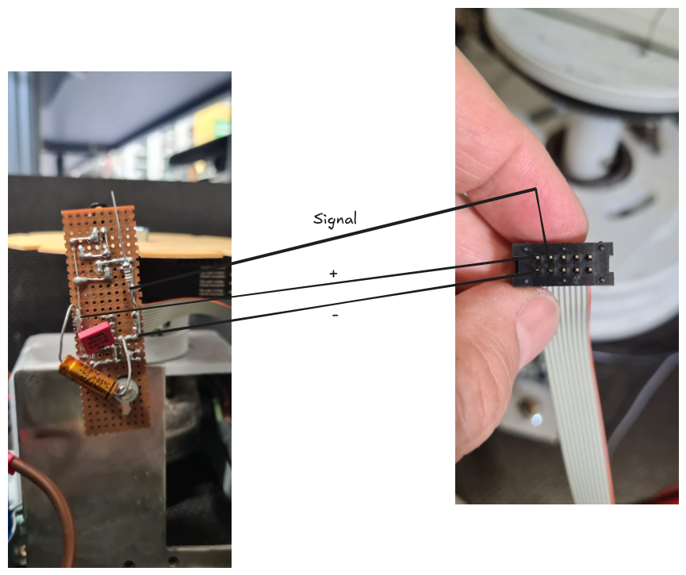
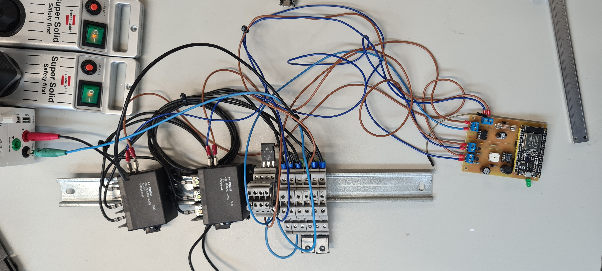

# Medien zur Dokumentation des Projektes

## Reengenering der Basis
Das Projekt besteht aus drei Hauptkomponenten: der Basis, dem Drehteller mit dem Wurfarm und der Hand-Steuerung für die Spieler. Die Basis ist die Plattform, auf der alles montiert wird. Der Drehteller ist das rotierende Element, das die Spielfigur bewegt. Die Steuerung ist die Elektronik, die die Motoren ansteuert und die Logik des Spiels umsetzt.
Die Basis gründet auf einem früheren Projekt, das dazu diente eine Person vor einer Kamera zu drehen, damit sich von Kameras aus eine 360°-Ansicht ergibt. Die Basis wurde für dieses Projekt angepasst, um die Anforderungen des Spiels zu erfüllen. 
Dazu wurde die Basis mit einem Drehteller ausgestattet, der eine präzise Steuerung der Drehbewegung ermöglicht. Der Drehteller ist mit einem Motor verbunden, der über PWM angesteuert wird. Die Steuerung erfolgt über einen Mikrocontroller, der die Logik des Spiels umsetzt und die Motoren ansteuert. Schon aus einem Vorprojekt wurde eine Messung der Drehung durch eine Lichtschranke in 4°-Schritten übernommen. Diese ermöglicht eine präzise Steuerung der Drehbewegung und eine einfache Implementierung der Spielmechanik. Die Steuerung war ursprünglich mid einem Arduino Uno realisiert, wurde aber für dieses Projekt auf einen ESP32 umgestellt, um eine bessere Leistung und Flexibilität zu bieten. Der ESP32 ermöglicht eine einfache Anbindung an WLAN und Bluetooth, was für zukünftige Erweiterungen des Projekts von Vorteil ist.

[Sourcen hierzu](https://excalidraw.com/#json=Fsf5mJjJgpFNbdMAiqwth,yLLVnhWq_IdeKSUIlJyX0Q)

## Reengenering des Wurfarms
Der Wurfarm ist das Herzstück des Spiels. Er wurde aus einem früheren Projekt übernommen, das eine Steuerung für einen fliegenden Schlumpf realisiert hat. Leider sind die Schaltpläne und die Dokumentation dieses Projekts nicht mehr verfügbar, aber die Mechanik des Wurfarms wurde erfolgreich in dieses Projekt integriert. Der Wurfarm ist mit einem Motor verbunden, der über PWM angesteuert wird. Die Steuerung erfolgt ebenfalls über den ESP32, der die Logik des Spiels umsetzt und die Motoren ansteuert.

Aktuell kann der Wurfarm sich "nur" vor und zurück bewegen. Zukünftig soll der Wurfarm feiner in der Höhe positionierbar sein, um die Spielfigur in verschiedene Höhen um zu werfen.
Die alte Controllerplatine ist [hier](./Alte%20Controler-Platine.FCStd) zu finden. Sie wurde für dieses Projekt nicht verwendet, da sie nicht mehr verfügbar ist. Stattdessen wird in der nächsten Projektphase eine neue Platine entwickelt, die die Anforderungen des Spiels erfüllt und eine einfache Ansteuerung des Wurfarms ermöglicht.

Die Leistungselektronik des Wurfarms besteht aus einem MOSFET, der den Motor ansteuert. Der MOSFET wird über den ESP32 angesteuert und ermöglicht eine präzise Steuerung der Drehbewegung. Die Steuerung erfolgt über PWM, was eine einfache Implementierung der Spielmechanik ermöglicht. Hier der Stand aus dem Vorprojekt:

Mit zwei Relais kan die Laufrichtung des Motors umgekehrt werden, um den Wurfarm vorwärts und rückwärts zu bewegen. Die Relais sind über den ESP32 angesteuert und ermöglichen eine einfache Steuerung der Motoren. 

## Reengenering der Handsteuerung
Die Handsteuerung ist eine Fernbedienung, die es den Spielern ermöglicht, den Wurfarm zu steuern und die Spielfigur zu bewegen. Sie wurde aus einem früheren Projekt übernommen, das eine Handsteuerung für den fliegenden Schlumpf realisiert hat. Die Handsteuerung besteht aus einem Mikrocontroller, der die Tastenanschläge der Spieler erfasst und an den ESP32 sendet. Der ESP32 interpretiert die Eingaben und steuert den Wurfarm entsprechend. Die Handsteuerung ist kabellos und ermöglicht eine einfache Bedienung des Spiels